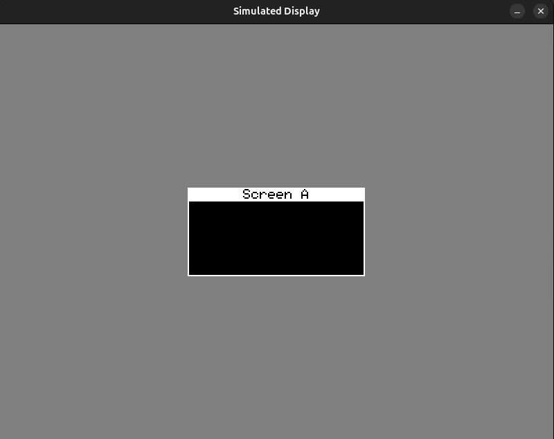

There might be situations when you don't have the hardware available, or you want to debug your application deeply. Then you should use the SDL backend provided.

This acts like a simulated display.



Features:

 - Zoom In/Out
 - Better application debugging
 - More WIP

The SDLDisplay inherits from **Display.h** and defines itself just like any other display.


# Example

Below is an usage example:

```cpp
#include "platform/sdl/SDLDisplay.h"
#include "platform/sdl/SDLWindow.h"

#include "core/Graphics.h"
#include "widgets/Screen.h"
#include "core/Stack.h"

#define SCREEN_WIDTH 800
#define SCREEN_HEIGHT 600


SDLDisplay display(
    128,
    64
);

Graphics gfx(&display);

SDLWindow window(&display);

Stack screenStack(display, gfx);
Screen screen_a(&display, "Screen A");

void setup() {
    screenStack.addScreen(screen_a);

    display.clear();
    screenStack.goTo(display, screen_a, gfx);
    display.flush();
}

void loop() {
    screenStack.renderApp(gfx);
    display.flush();
}

int main() {
    window.create();
    window.loop(loop, setup);
}
```

Please see **Displays** for display related functions.

# SDLWindow::SDLWindow()
Params:
 - SDLDisplay *display

Creates an instance of SLDWindow.


# SDLWindow::create()

Internally creates SDL window, renderer and inits the framebuffer.

# SDLWindow::loop()
Params:

 - std::function<void()> applicationSetup

 - std::function<void()> applicationLoop

Starts a SDL loop, you must provide your application setup loop similar to Arduino

**applicationSetup** contains the instruction that run only once when application starts.

**applicationLoop** is where your application run it's own loop within the SDL loop.

Please view the example above.
