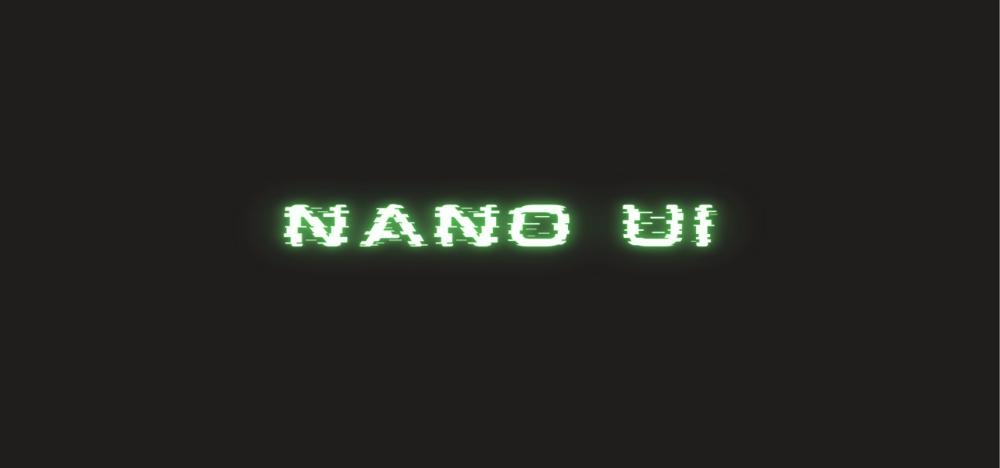
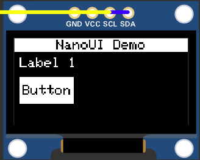

# Nano UI 

A minimal user-interface framework for micro-controllers and low memory devices.




Documentation [here](https://raghav67816.github.io/NanoUI/)


## Features
 - Wide range of widgets
 - Event System
 - Low memory footprint
 - Supports SPI/TFT Displays


This set of features allows developers to make reactive UI for micro-controllers. 

Bind your widgets to events, trigger then with your physical components.

## Example



```cpp
#include <Arduino.h>
#include <Adafruit_GFX.h>
#include <Adafruit_SSD1306.h>

#include "core/Graphics.h"
#include "core/OLEDisplay.h"

#include "widgets/Screen.h"
#include "widgets/Button.h"
#include "widgets/Label.h"

#include "layouts/Column.h"

#define SCREEN_WIDTH 128
#define SCREEN_HEIGHT 64

#define BTN_PIN 4

// ==============================
// OLED Display Setup
// ==============================

Adafruit_SSD1306 oled(
    SCREEN_WIDTH,
    SCREEN_HEIGHT,
    &Wire,
    -1
);

// NanoUI display abstraction
OLEDisplay display(
    SCREEN_WIDTH,
    SCREEN_HEIGHT,
    &oled
);

// Graphics renderer
Graphics gfx(&display);

// ==============================
// Colors
// ==============================

Color white = {255, 255, 255};
Color black = {0, 0, 0};

// ==============================
// UI Widgets
// ==============================

// Main screen
Screen screen(&display, "NanoUI Demo");

// Vertical layout
Column layout(
    0,
    0,
    SCREEN_WIDTH,
    SCREEN_HEIGHT - 10
);

// Widgets
Label label(
    20,
    10,
    "Label 1",
    white
);

Button button(
    40,
    20,
    "Button",
    white,
    black
);

// ==============================
// Button Callback
// ==============================

void onButtonPress(){
    Serial.println("Button Pressed");
}

// ==============================
// Arduino Setup
// ==============================

void setup(){

    pinMode(BTN_PIN, INPUT_PULLUP);

    Serial.begin(9600);

    // Initialize OLED
    if(!oled.begin(SSD1306_SWITCHCAPVCC, 0x3C)){
        return;
    }

    // Bind button event
    button.bindEvent(
        BUTTON_PRESSED,
        onButtonPress
    );

    // Add widgets to layout
    layout.addChild(&label);
    layout.addChild(&button);

    // Add layout to screen
    screen.addChild(&layout);

    // Render UI
    display.clear();

    screen.draw(gfx);

    display.flush();
}

// ==============================
// Arduino Loop
// ==============================

void loop(){

    // Simulate button event
    if(digitalRead(BTN_PIN) == LOW){

        button.onEvent(BUTTON_PRESSED);

        delay(200);
    }
}
```
