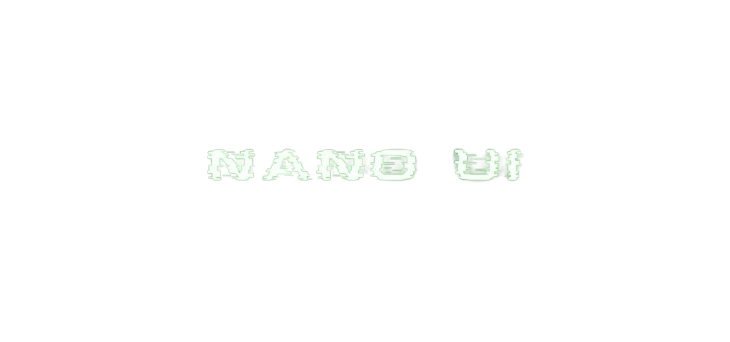

# Nano UI

Nano UI is a user-interface framework for micro-controllers and edge devices. It allows developers to build beautiful interface with wide range of optimised widgets. The event driven architecture allows devs to keep UI logic separated from systems logic.

## Features
- Hardware Independent Library
- Lower Memory Footprint
- Support SPI and TFT Displays*
- Wide Range of Widgets
- Event Driven Architecture
- Simple API
- SDL Backend for Faster Development

## Available Widgets
 - Screen
 - Layouts (Row & Column)
 - Button
 - Progress Bar
 - List Widget
 - Label

You can even make custom widgets !!!!!

**Please note that the project is still under development. However, API design will remain consistant more widgets and fixes will pushed regularly.**

## Installation / Usage

It is recommended to use PlatformIO 

 - Download the latest source code.
 - Unzip and move the folder to your lib folder of your PlatformIO project folder.
 - Write your code
 - Flash your firmware to your board.
